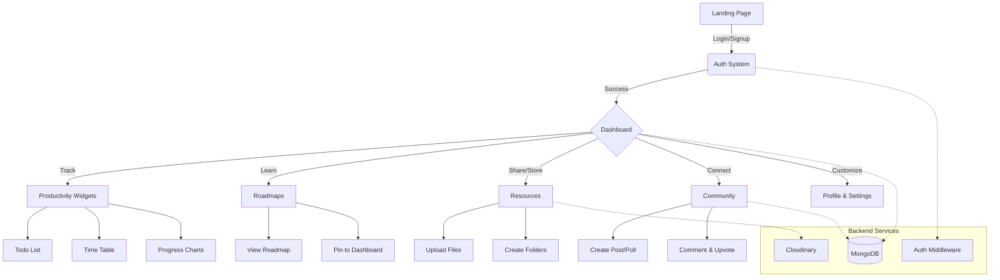

# Student Platform (STC) - Your All-in-One Learning Companion

[](https://stc-client.onrender.com/)


## Overview

**Student Platform (STC)** is a comprehensive web application designed to empower students in their self-learning journey. It addresses the common challenges of fragmented resources, lack of structured guidance, and isolation by providing a centralized hub for productivity, learning, and community engagement.

### The Problem
Students often struggle with:
-   **Information Overload:** Too many resources scattered across different platforms.
-   **Lack of Direction:** Not knowing what to learn next or how to structure their studies.
-   **Isolation:** Learning alone without peer support or feedback.
-   **Disorganization:** Difficulty tracking progress, tasks, and schedules effectively.

### The Solution
STC solves these problems by integrating:
-   **Structured Roadmaps:** Clear, step-by-step guides for mastering new skills.
-   **Centralized Resources:** A unified place to store and share notes, links, and files.
-   **Productivity Tools:** Built-in To-Do lists, Time Tables, and Progress tracking.
-   **Community Support:** A platform to ask questions, share knowledge, and connect with peers.

---

## Key Features

### 1. Interactive Dashboard
Your personal command center.
-   **Progress Tracking:** Visual pie charts showing your completion status of coding problems.
-   **Task Management:** A simple yet effective To-Do list to keep you on track.
-   **Time Table:** Upload and view your class or study schedule anytime.
-   **Analytics:** Weekly and monthly analysis of your study habits.
-   **Pinned Roadmaps:** Quick access to the learning paths you are currently focused on.

### 2. Learning Roadmaps
Don't get lost in the sea of tutorials.
-   **Curated Paths:** Frontend, Backend, DevOps, AI/ML, and more.
-   **Progressive Learning:** Step-by-step modules to ensure a solid foundation.
-   **Pinning System:** Save roadmaps to your dashboard for easy access.

### 3. Resource Hub
Organize your learning materials.
-   **File Management:** Upload and organize notes, PDFs, and images.
-   **Folder Structure:** create nested folders to keep subjects separate.
-   **Link Sharing:** Save important URLs for later reference.

### 4. Community & Support
Learn together, grow together.
-   **Discussion Forums:** Post questions, share insights, and get answers.
-   **Polls:** Participate in community decisions or fun surveys.
-   **Profile System:** Showcase your skills, bio, and interests with a customizable profile.

---

## Tech Stack

This project is built using the MERN stack with modern tools for performance and UI.

-   **Frontend:** React (Vite), TypeScript, TailwindCSS, DaisyUI, Recharts, Framer Motion.
-   **Backend:** Node.js, Express.js.
-   **Database:** MongoDB (Mongoose).
-   **Authentication:** JWT (JSON Web Tokens) with secure HTTP-only cookies.
-   **File Storage:** Cloudinary.
-   **Deployment:** Ready for deployment on platforms like Render or Vercel.

---

## User Flow Diagram



---

## Getting Started

Follow these steps to set up the project locally on your machine.

### Prerequisites
-   Node.js (v16 or higher)
-   MongoDB (Local or Atlas URI)
-   Cloudinary Account (for image uploads)

### Installation

1.  **Clone the Repository**
    ```bash
    git clone https://github.com/yourusername/student-platform.git
    cd student-platform
    ```

2.  **Install Dependencies**
    You need to install dependencies for both the client (frontend) and server (backend).
    
    ```bash
    # Install server dependencies
    cd server
    npm install
    
    # Install client dependencies
    cd ../client
    npm install
    ```

3.  **Environment Setup**
    Create a `.env` file in the `server` directory with the following variables:
    
    ```env
    PORT=5000
    MONGO_URI=mongodb+srv://<your-db-uri>
    JWT_SECRET=your_super_secret_key_change_this
    CLIENT_URL=http://localhost:5173
    
    # Cloudinary Config
    CLOUDINARY_CLOUD_NAME=your_cloud_name
    CLOUDINARY_API_KEY=your_api_key
    CLOUDINARY_API_SECRET=your_api_secret
    ```

4.  **Run the Application**
    Open two terminal windows.
    
    **Terminal 1 (Backend):**
    ```bash
    cd server
    npm run dev
    ```
    
    **Terminal 2 (Frontend):**
    ```bash
    cd client
    npm run dev
    ```

5.  **Access the App**
    Open your browser and navigate to `http://localhost:5173`.

---

## Contributing

Contributions are welcome! If you have ideas for new features or improvements:
1.  Fork the repository.
2.  Create a new branch (`git checkout -b feature/AmazingFeature`).
3.  Commit your changes.
4.  Push to the branch.
5.  Open a Pull Request.

---


